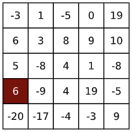

# INFO8003-1: Optimal Decision Making for Complex Problems
## Project 1: Reinforcement Learning in a Discrete Domain
### Authors: Romain LAMBERMONT, Arthur LOUIS

This project is part of the course of Optimal Decision Making for Complex Problems at the University of Liège. The course is given by Prof. Damien Ernst with the help of his teaching assistants Arthur Louette and Bardhyl Miftari. The goal of this project is to implement a reinforcement learning agent in a discrete domain, a matrix where each cell reached by the agent returns a reward. The statement can be seen [here](./documents/Statement.pdf) and the report can be seen [here](./report/report.pdf).

    
    
<em>This matrix represents the domain of interest that we use during the project .</em>

### Sections
- Section 1: Implementation of the Domain [section1.py](./code/section1.py)
- Section 2: Expected Return of a Policy [section2.py](./code/section2.py)
- Section 3: Optimal Policy [section3.py](./code/section3.py)
- Section 4: System Identification [section4.py](./code/section4.py)
- Section 5: Q-Learning in a Batch Setting [section5.py](./code/section5.py)